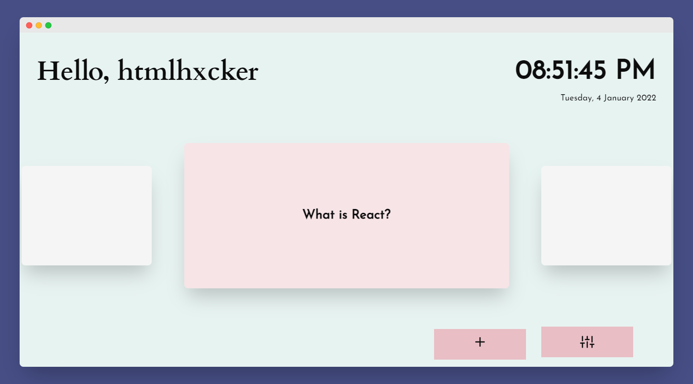
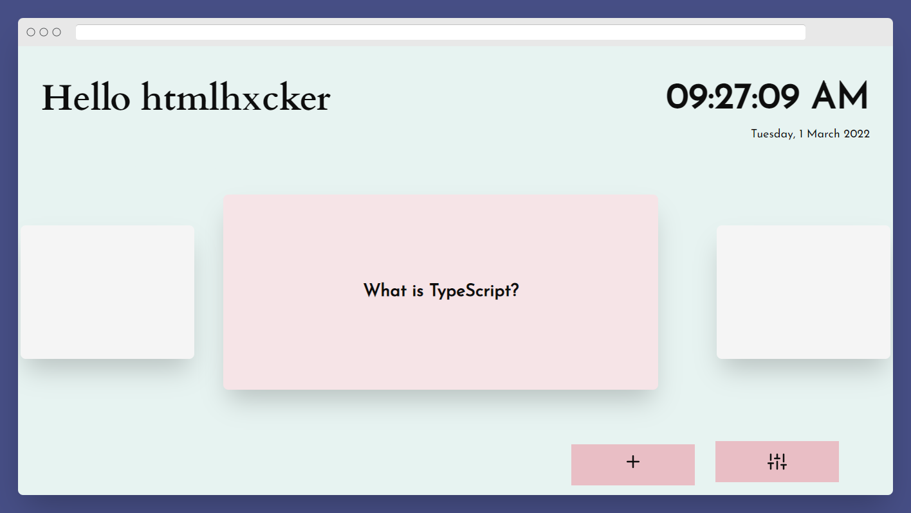

<div id="top"></div>


<br />
<div align="center">
  <a href="https://github.com/github_username/repo_name">
    
  </a>

<h3 align="center">PrepCards</h3>

  <p align="center">
    PrepCards is a Chrome extension that helps you remember things you're prone to forget by using flashcards.
    <br />
    <a href="#">Donwload on Chrome Webstore</a>
    <br />
    <a href="https://github.com/htmlHxcker/devPrep/issues/new?&template=bug_report.md">Report Bug</a>
    <br />
    <a href="https://github.com/htmlHxcker/devPrep/issues/new?template=feature_request.md">Request Feature</a>
    <br />
  </p>
</div>

<!-- TABLE OF CONTENTS -->
<details>
  <summary>Table of Contents</summary>
  <ol>
    <li>
      <a href="#about-the-project">About The Project</a>
      <ul>
        <li><a href="#built-with">Built With</a></li>
      </ul>
    </li>
    <li>
      <a href="#getting-started">Getting Started</a>
      <ul>
        <li><a href="#prerequisites">Prerequisites</a></li>
        <li><a href="#installation">Installation</a></li>
      </ul>
    </li>
    <li><a href="#usage">Usage</a></li>
    <li><a href="#roadmap">Roadmap</a></li>
    <li><a href="#contributing">Contributing</a></li>
    <li><a href="#license">License</a></li>
    <li><a href="#contact">Contact</a></li>
    <li><a href="#acknowledgments">Acknowledgments</a></li>
  </ol>
</details>


<!-- ABOUT THE PROJECT -->
## About The Project
 
 

PrepCards is a Chrome extension that uses Flashcards to help remind you of things you're prone to forget like when learning a new language or studying a totally new topic or anything you can think of as far as it can be represneted in text.
<p align="right">(<a href="#top">back to top</a>)</p>


### Built With


* [React.js](https://reactjs.org/)
* [Webpack](https://webpack.js.org/)


<p align="right">(<a href="#top">back to top</a>)</p>


<!-- GETTING STARTED -->
## Getting Started


To setup PrepCards on your system follow the steps outlined below.

### Prerequisites

For this application to work you need Node and Yarn
* npm
  ```sh
  npm install npm@latest -g
  ```
* Yarn
Enable corepack (Node.js >=16.10)
```sh
corepack enable
```
Node.js <16.10
```sh
npm i -g corepack
```

### Installation

1. Clone the repo
   ```sh
   git clone https://github.com/htmlHxcker/devPrep.git
   ```
2. Install NPM packages
   ```sh
   cd devPrep
   yarn install
   ```
3. Build an unpacked extension
    ```sh
       yarn run dev
    ```
4. Go to `chrome://extensions` in your browser and toggle developer mode, after that click "Load Unpacked" and select the generated `dist` folder.

<p align="right">(<a href="#top">back to top</a>)</p>


<!-- USAGE EXAMPLES -->
## Usage

### Language Learning: 
You can use this extension to build vocabulary while learning another language
 

### Technical Interviews:
You can also use this to brush up on theoretical knowledge before technical interviews.


<p align="right">(<a href="#top">back to top</a>)</p>


<!-- ROADMAP -->
## Roadmap

- [ ] Dark Mode
- [ ] Spaced Repetition System


See the [open issues](https://github.com/htmlHxcker/devPrep/issues) for a full list of proposed features (and known issues).

<p align="right">(<a href="#top">back to top</a>)</p>


<!-- CONTRIBUTING -->
## Contributing

Contributions are what make the open source community such an amazing place to learn, inspire, and create. Any contributions you make are **greatly appreciated**.

If you have a suggestion that would make this better, please fork the repo and create a pull request. You can also simply open an issue with the tag "enhancement".
Don't forget to give the project a star! Thanks again!

1. Fork the Project
2. Create your Feature Branch (`git checkout -b feature/AmazingFeature`)
3. Commit your Changes (`git commit -m 'Add some AmazingFeature'`)
4. Push to the Branch (`git push origin feature/AmazingFeature`)
5. Open a Pull Request

<p align="right">(<a href="#top">back to top</a>)</p>


<!-- LICENSE -->
## License

Distributed under the MIT License.

<p align="right">(<a href="#top">back to top</a>)</p>


<!-- CONTACT -->
## Contact

Project Link: [https://github.com/htmlHxcker/devPrep](https://github.com/htmlHxcker/devPrep)

<p align="right">(<a href="#top">back to top</a>)</p>
