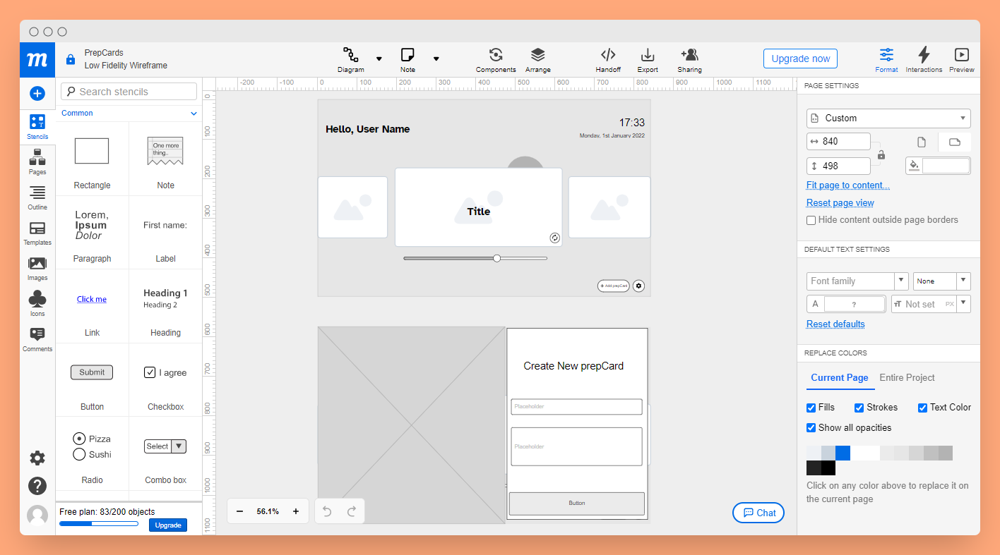
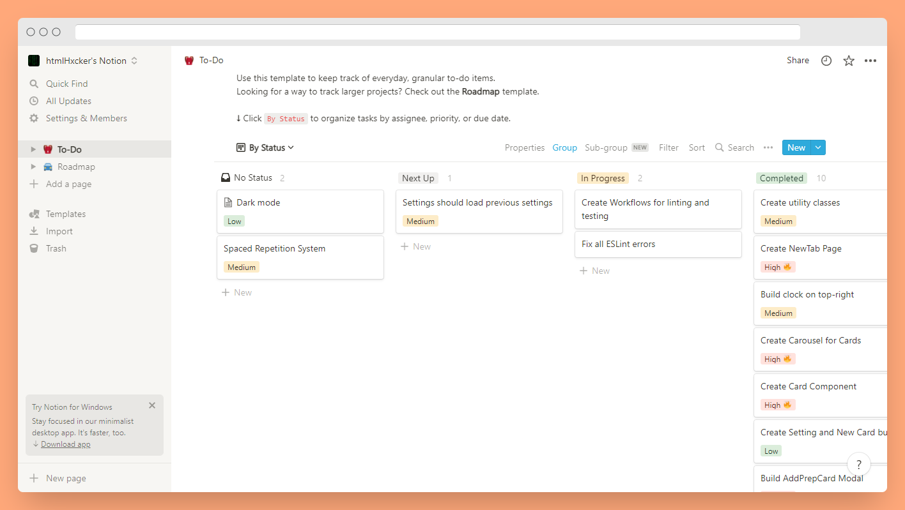

# PrepCard

<div align="center">
    <a href="#">
        
    </a>
    <h1>
        <a href="#">
            PrepCard
        </a>
    </h1>
</div>

#### Table of contents

- [What is PrepCard?](#what-is-prepcard)
- [How I worked on this Project](#how-i-worked-on-this-project)
- [Structure of the project](#structure-of-the-project)
- [Challenges](#challenges)
- [Roadmap](#roadmap)
- [Developing Locally and Contributing](#developing-locally-and-contributing)
- [Appreciation](#appreciation)

---

## What is PrepCard?


PrepCard is a project I conceived while learning Japanese along with some other
people and preparing for technical interviews. I didn't know of
[Anki](https://ankiweb.net), or any of it's contemporaries and decided that
flashcards could be a good way for me to practice. This is the first project
that I've embarked on where I was building software for other people (My
_co-learners_) and so I had to think a lot about how an end user would interact
with the extension.

---

## How I worked on this project

I tried to simulate a professional work environemt ~~Where almost all PR's are
merged~~ 👀 by:

- Building the app based on a _Moqup_, which gave me a good outline of how I
  would like it to look:
  
- I also, created tasks in Notion and worked based on these tasks which created
  a good workflow for me: 
- I also made use of feature branches and Pull Requests: [Pull Request that introduced deleting functionality](https://github.com/htmlHxcker/devPrep/pull/4)

## Structure of the Project

- Cards and settings are stored in the Chromium browser implementation of
  `localStorage` for extensions: [Storage.js](https://github.com/htmlHxcker/devPrep/blob/master/src/utils/storage.js)
- The application state uses Redux when a particular piece of state is required by more than one component to avoid prop drilling [Link to example code on GitHub]
  tab page: [Redux Store](https://github.com/htmlHxcker/devPrep/blob/master/src/store.js)
-  A custom Updating and Deleting functionality had to be built which works as a pseudo-API since the storage API doesn't support such functionalities natively [Editing and Deleting](https://github.com/htmlHxcker/devPrep/blob/409c26c9d5f2d68e9c82784c99eb50c018ea123c/src/utils/storage.js?_pjax=%23js-repo-pjax-container%2C%20div%5Bitemtype%3D%22http%3A%2F%2Fschema.org%2FSoftwareSourceCode%22%5D%20main%2C%20%5Bdata-pjax-container%5D#L19).
- All styles that are not component specific are stored in utilities.css to avoid verbosity [utilities.css](https://github.com/htmlHxcker/devPrep/blob/master/src/styles/utilities.css)
- All Top-level components (i.e Components found in the /src/ui folder) ride on the same principle as index.js/App.js / index.html in typical create-react-apps when bundled.
- Integration tests use the React testing library:

## Why I built the project this way

- I originally built this project with only React's useState but as the project grew, I found myself passing state unto grandchildren and great-grandchildren props, Redus was the best solution I could think of, since there was no traditional server-side it was a better choice (in my opinion) than GraphQL.
- I did not use any styling library or CSS Framework as I wanted to solidify my CSS skills and learn to live without frameworks (Just in case the Apocalypse wipes out all frameworks😄).
- Even though I could build a server for storing the data, i figured that would be overengineering and instead decided to expand and customize the in-built storage functionality in Chrome


## Challenges
- Testing has been a huge hassle for me with this project is in a rather niche situation i.e using React to build a Chrome extension and that means traditional testing methods may not necessarily work e.g The test fails when asked to query the storage API since that isn;t a native browser functionality. Currently I use react-testing-library but I'm considering moving to Puppeteer as that would suit my purpose.

- I haven't been able to load the settings the user already selected when the Options page renders and so the user isn't able to know which options they previously selected.

- I encountered a funny bug where if the user was to add a card and without hard-refreshing the page deleted the card, the whole extension would crash, this was one of the toughest challenges I had and eventually I was able to solve it by dispatching a `DECREMENT` current action so that the Extension didn't start looking for an undefined card.

## Roadmap
- Dark Mode: Preferably the dark mode would work based on the System's setting.
- Spaced Repetition System: I've looked for a JS implementation of the SM-2 Algorithm but so far, I've found none that really works so I'm working on my own library which I hope to integrate with the Extension.
- Complete the GitHub Actions Pipeline to make sure only non-breaking code is pushed to master
- Add end-to-end tests with Cypress.

## Developing Locally and Contributing
If you want to contribute to this project start by forking the repo and then cloning it to your machine.

Then create your feature branch using the format
```bash
git checkout -b "<author>_<branch-type>_<branch-name>"
```
e.g
```bash
git checkout -b "htmlHxcker_feature_dark-mode"
```

If you want to report a bug, you can create an issue and use the BUG template.
## Appreciation

I want to thank the wonderful group of people (The Odinsons Team) with whom I've been walking the coding path since 2020. They were a huge support for this project and helped cheer me on.


